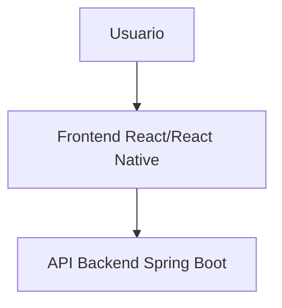
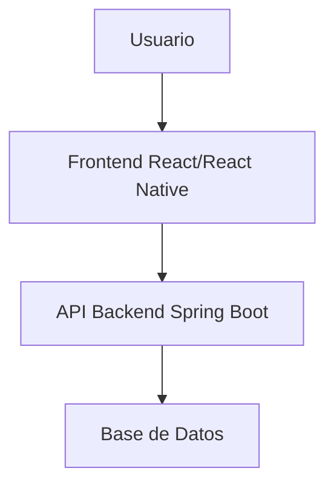
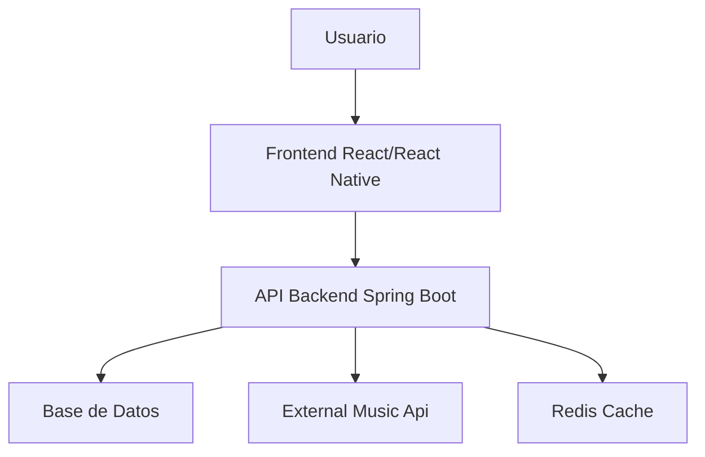

# Desafío Groovelist Full Stack  :earth_americas: :computer: 

**¡Bienvenido a nuestro desafío de desarrollo!**

_Por favor, asegúrate de leer este documento en su totalidad y aclarar cualquier duda con nuestro equipo si surge alguna._

Este desafío tiene la finalidad de evaluar tus habilidades como desarrollador FullStack.

:rocket: ¿Todo listo? ¡Vamos allá!

# Contexto :game_die:

Tu misión es desarrollar una aplicación de gestión de un catálogo musical. Esta aplicación deberá ser capaz de listar, agregar y modificar la información de las canciones y su relación con los álbumes a los que pertenecen.

## Modelo de datos :memo:

### Song

    {
    "id": 1, // Identificación de la canción
    "title": "Nombre de la canción", // Nombre de la canción *Obligatorio
    "duration": "03:50", // Duración de la canción *Obligatorio
    "albumId": 123, // ID del álbum al que pertenece la canción *Obligatorio
    "updatedAt": "2023-07-09T11:37:42.318Z", // Fecha y hora de la última actualización *Obligatorio
    "createdAt": "2023-07-09T11:37:42.318Z" // Fecha y hora de registro *Obligatorio
}

 
### Album

    {
    "id": 123, // Identificación del álbum
    "title": "Nombre del álbum", // Nombre del álbum *Obligatorio
    "year": 2023, // Año de lanzamiento del álbum *Obligatorio
    "updatedAt": "2023-07-09T11:37:42.318Z", // Fecha y hora de la última actualización *Obligatorio
    "createdAt": "2023-07-09T11:37:42.318Z" // Fecha y hora de registro *Obligatorio
    }

## Requisitos funcionales :white_check_mark:

### Backend :earth_americas:

-   La API debe seguir las mejores prácticas y estándares de implementación REST.
-   Escribe pruebas para el código generado y las API.
-   Proporciona documentación para la API (Sugerencia: OpenAPI/Swagger).
-   Utiliza **Spring Boot** para el desarrollo del backend. **JDK 11+**

### Frontend :computer:

-   Crear una pantalla de inicio con un menú para acceder a las funciones.
-   Una pantalla de lista para cada una de las entidades (canciones y álbumes).
-   Una pantalla de registro para cada una de las entidades.
-   Implementar la solución usando **React** o **React Native** 
-   Siéntete libre de usar bibliotecas de componentes de mercado o crear las tuyas propias.

## Diferencial :crossed_swords:

-  Almacenar los datos en una base de datos. (incluir dockerfile)
- Documentación clara del código. ¡El código comentado siempre es bienvenido!
-   Uso de patrones de diseño y buenas prácticas.
-   ¡Buenos mensajes de commit son útiles!
-   Implementar funcionalidad de búsqueda de canciones.

## Requisitos no funcionales :cool:

-   Incluir un archivo README.md con un resumen de las elecciones de marcos, bibliotecas, bases de datos y cómo ejecutar tu proyecto.

## Opcional - Requisitos avanzados :grey_exclamation:

-   Implementar funcionalidades de streaming para las canciones.
- Implementar el consumo de una [API externa asociada a música](https://github.com/public-apis/public-apis#music) e integrar alguna característica 
-   Implementar una funcionalidad que permita manipular el espectrograma asociado a cada canción.

## Flujo básico:

## Flujo medio:

## Flujo avanzado:

# Lo que valoramos :dart:

-   La calidad del código: Claro y fácil de leer, siguiendo buenas prácticas de programación.
-   La organización del proyecto: Estructura de los archivos y carpetas.
-   El diseño de la aplicación: Que sea intuitivo y fácil de usar.
-   Pruebas: Que el código tenga pruebas que aseguren su correcto funcionamiento.
-   Desarrolladores curiosos y motivados!!

# FAQ :question:

Por favor, si tienes alguna duda no dudes en preguntar. Valoramos la comunicación y estaremos encantados de aclarar cualquier pregunta que puedas tener.

**Siéntete libre de innovar o incluir  lo que sientas que aporta valor a  tu desafío.**

¡Buena suerte y esperamos ver tu solución pronto!

